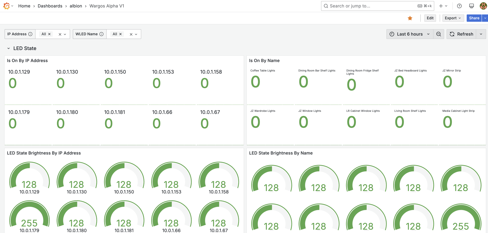
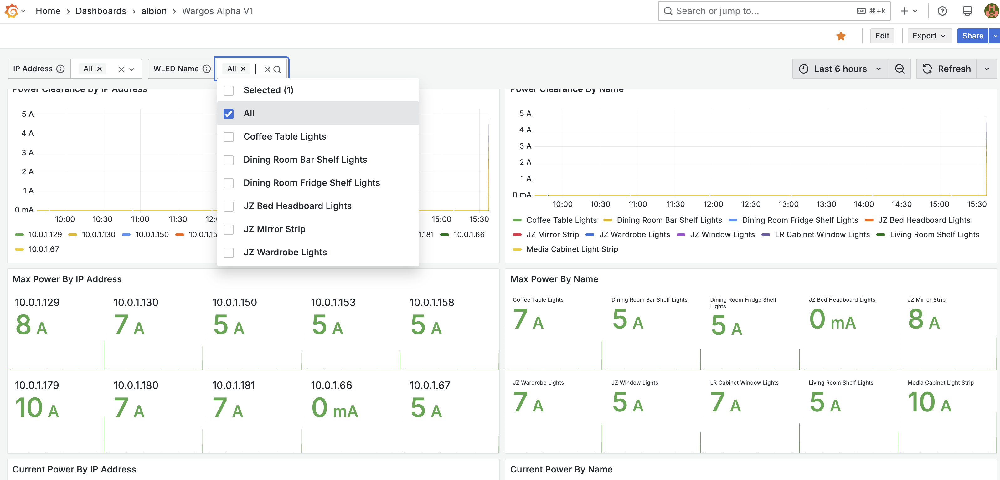

# wArgos

[](https://GitHub.com/jzucker2/wargos/releases/)
[](https://github.com/jzucker2/wargos/actions/workflows/docker.yml)
[](https://github.com/jzucker2/wargos/actions/workflows/python_unittests.yml)
[](https://github.com/jzucker2/wargos/actions/workflows/python_lint.yml)
[](https://github.com/jzucker2/wargos/actions/workflows/dependabot/dependabot-updates)


I plan on using the Home Assistant wled library: `wled` located here: <https://pypi.org/project/wled/>

Want a [grafana](https://grafana.com/oss/grafana/) dashboard like this?







## Features

### Metrics Collection

- **Prometheus Metrics**: Comprehensive metrics collection from WLED devices
- **Real-time Monitoring**: Live monitoring of LED strips, effects, and device status
- **Multi-device Support**: Monitor multiple WLED instances simultaneously
- **Release Tracking**: Monitor WLED firmware releases and versions

### Config and Preset Backup

- **Automatic Backups**: Collect configuration and preset backups from WLED instances
- **Configurable Storage**: Store backups in customizable directories
- **Organized Structure**: Files are stored in IP-specific subdirectories with separate folders for configs and presets (`/backups/{ip}/configs/` and `/backups/{ip}/presets/`)
- **Metadata Tracking**: Each backup includes timestamp and device information
- **Bulk Operations**: Backup all devices or individual instances
- **Download Latest**: Download the most recent backup for any device
- **Metadata Control**: Option to include or strip backup metadata from downloads
- **Error Handling**: Robust error handling for network and file system issues
- **Prometheus Metrics**: Comprehensive metrics for monitoring backup operations

For detailed information about the config backup feature, see [CONFIG_BACKUP.md](./CONFIG_BACKUP.md).

## How to Run

### Configure Docker Compose

Example `docker-compose.yml` like:

```yaml
services:

  wargos:
    image: ghcr.io/jzucker2/wargos:latest
    container_name: wargos
    restart: always
    extra_hosts:
      - "host.docker.internal:host-gateway"
    # Include this to persist config and presets backups outside of container (across restarts, upgrades)
    volumes:
      - wargos-storage:/backups
    environment:
      # Replace with your `wled` IP addresses
      - WLED_IP_LIST=10.0.1.129,10.0.1.150,10.0.1.179,10.0.1.153
      # Gunicorn configuration (optional - defaults shown)
      - PORT=9395
      - WORKERS=1
      - TIMEOUT=120
      - KEEPALIVE=2
      - MAX_REQUESTS=1000
      - MAX_REQUESTS_JITTER=50
      # Enable/disable release checking (optional - defaults to true)
      - ENABLE_RELEASE_CHECK=false
    ports:
      - "9395:9395"
    stdin_open: true
    tty: true

volumes:
  wargos-storage:
    driver: local
```

### Set Env Vars

By default, logging is info level. To set to debug, provide the env `DEBUG=true` flag

|                  Env Var Name                   | Default Value |           Example Value            |                                         Description                                          |
|:-----------------------------------------------:|:-------------:|:----------------------------------:|:--------------------------------------------------------------------------------------------:|
|                     `DEBUG`                     |    `false`    |               `true`               |                     This determines debug logging and a few other things                     |
| `DEFAULT_WLED_INSTANCE_SCRAPE_INTERVAL_SECONDS` |     `60`      |                `30`                |     This determines how often `wargos` scrapes prometheus metrics from `wled` instances      |
| `DEFAULT_WLED_FIRST_WAIT_SECONDS`              |     `30`      |                `15`                |     This determines how long to wait before the first scrape after startup                   |
| `DEFAULT_WLED_IP`                              | `10.0.1.179`  |            `10.0.1.100`            |     This is the default IP address used when no IP list is provided                         |
| `WLED_IP_LIST`                                 |    `None`     | `10.0.1.129,10.0.1.150,10.0.1.179` |     Comma-separated list of WLED device IP addresses to scrape                              |
| `ENABLE_RELEASE_CHECK`                         |    `true`     |              `false`               |     Enable or disable WLED release checking (true/false, 1/0, yes/no, on/off)              |
| `CONFIG_BACKUP_DIR`                            | `/backups/` |     `/home/user/wled_backups`      | Directory where WLED config backups are stored |
|                     `PORT`                      |    `9395`     |               `9395`               | The port on which the Gunicorn server will listen |
|                   `WORKERS`                     |      `4`      |                `1`                 | Number of Gunicorn worker processes |
|                  `TIMEOUT`                      |    `120`      |                `60`                | Worker timeout in seconds |
|                 `KEEPALIVE`                     |      `2`      |                `5`                 | Keep-alive connection timeout |
|               `MAX_REQUESTS`                    |   `1000`      |               `500`                | Maximum requests per worker before restart |
|           `MAX_REQUESTS_JITTER`                 |     `50`      |                `25`                | Jitter for max requests to prevent all workers restarting at once |

## Running the Application

### Local Development

**Option 1: Gunicorn (Production-like)**

```bash
# Run with default settings
make run

# Run with custom settings
PORT=9395 WORKERS=2 make run

# Run directly with script
./scripts/run_gunicorn.sh

# Run with custom environment variables
PORT=9395 WORKERS=2 TIMEOUT=60 ./scripts/run_gunicorn.sh
```

**Option 2: Uvicorn (Development)**

```bash
# Run with Uvicorn for development
make run-uvicorn

# Or directly
uvicorn app.main:app --reload --host 0.0.0.0 --port 9395
```

### Docker Deployment

The application uses Gunicorn with Uvicorn workers for production deployment. The Docker setup includes:

- **Multi-stage build** for optimized image size
- **Configurable environment variables** for port, workers, and performance tuning
- **Health checks** for container monitoring
- **Alpine Linux base** for security and size efficiency

## Testing

The project includes a comprehensive test suite with **104 tests** and comprehensive code coverage.

#### Prerequisites

1. **Virtual Environment**: Ensure you have a Python virtual environment set up

   ```bash
   python -m venv venv
   source venv/bin/activate  # On Windows: venv\Scripts\activate
   ```

2. **Install Dependencies**: Install both production and test dependencies

   ```bash
   pip install -r requirements.txt
   pip install -r requirements-dev.txt
   ```

#### Running Tests

**Option 1: Makefile (Recommended)**

```bash
# Run all tests
make test

# Run tests with coverage
make test-coverage

# Run specific test file
make test-file FILE=tests/test_basic.py
```

**Option 2: Pytest (Advanced)**

```bash
# Run all tests with verbose output
pytest tests/ -v

# Run with coverage report
pytest tests/ --cov=app --cov-report=term-missing

# Run specific test file
pytest tests/test_basic.py -v

# Run specific test class
pytest tests/test_basic.py::TestBasicFunctionality -v
```

**Option 3: Direct Python**

```bash
# Run all tests
python tests/run_tests.py

# Run specific test module
python tests/run_tests.py basic
```

#### Test Coverage

Current coverage across modules:

- **`app/utils.py`**: 100% coverage (28/28 statements)
- **`app/version.py`**: 100% coverage (1/1 statements)
- **`app/metrics.py`**: 100% coverage (143/143 statements)
- **`app/main.py`**: 69% coverage (27/39 statements)
- **`app/wled_client.py`**: 40% coverage (24/60 statements)
- **`app/scraper.py`**: 27% coverage (62/231 statements)

### GitHub Actions CI/CD

The project includes GitHub Actions for automated testing. The workflow file is located at `.github/workflows/tests.yml` and includes:

- **Multi-Python Testing**: Tests against Python 3.11 and 3.12
- **Dependency Caching**: Speeds up builds by caching pip dependencies
- **Coverage Reporting**: Generates coverage reports and uploads to Codecov
- **Automatic Triggers**: Runs on push to main/develop and all pull requests

#### Required Files

Ensure these files exist for GitHub Actions:

1. **`.github/workflows/tests.yml`** - The workflow file
2. **`requirements-dev.txt`** - Test dependencies
3. **`pytest.ini`** - Pytest configuration
4. **`Makefile`** - Make targets for testing

#### Optional: Codecov Integration

For enhanced coverage reporting, add a Codecov badge to your README:

```markdown
[](https://codecov.io/gh/yourusername/wargos)
```

### Test Structure

```
tests/
├── test_basic.py              # Basic functionality tests (9 tests)
├── test_version.py            # Version module tests (3 tests)
├── test_utils.py              # Utility functions tests (12 tests)
├── test_wled_client_simple.py # WLED client tests (7 tests)
├── test_scraper_simple.py     # Scraper tests (12 tests)
├── test_main_simple.py        # FastAPI app tests (5 tests)
├── run_tests.py               # Custom test runner
└── README.md                  # Test documentation
```

### Adding New Tests

When adding new functionality:

1. **Create test file**: `tests/test_<module_name>.py`
2. **Follow naming**: Test methods should start with `test_`
3. **Use mocking**: Mock external dependencies with `@patch` and `MagicMock`
4. **Test edge cases**: Include tests for error conditions and boundary cases
5. **Add docstrings**: Explain what each test validates

Example test structure:

```python
import unittest
from unittest.mock import patch, MagicMock
from app.your_module import YourClass

class TestYourClass(unittest.TestCase):
    """Tests for YourClass"""

    def test_something(self):
        """Test description"""
        # Your test code here
        self.assertTrue(True)

if __name__ == "__main__":
    unittest.main()
```

## wled

- <https://kno.wled.ge/>
  - main `wled` site
- <https://github.com/frenck/python-wled>
  - github repo for the python client
- <https://www.home-assistant.io/integrations/wled/>
  - Home Assistant page for the integration

## Prometheus

For prometheus I have some options:

- <https://github.com/trallnag/prometheus-fastapi-instrumentator>
- <https://github.com/prometheus/client_python>
- <https://prometheus.github.io/client_python/>
- <https://prometheus.github.io/client_python/exporting/http/fastapi-gunicorn/>

### Add to Prometheus for Metrics Collection

Add this to your `prometheus.yml`

```yaml
- job_name: 'wargos'

  # metrics_path defaults to '/metrics'
  # scheme defaults to 'http'.
  static_configs:
    - targets: [ '<host_ip>:9395' ]
      labels:
        instance: 'host_machine'
```

### Simple Prometheus Alerting

For examples of simple `prometheus` alerting, check out [prometheus/wargos_alerting_rules.yml](./prometheus/wargos_alerting_rules.yml)

## Scheduler

- <https://fastapi-utils.davidmontague.xyz/>
  - <https://github.com/dmontagu/fastapi-utils>
- <https://github.com/amisadmin/fastapi-scheduler>
- <https://github.com/amisadmin/fastapi-amis-admin>

## fastapi

I am new to fastapi

- <https://fastapi.tiangolo.com/tutorial/>
- <https://fastapi.tiangolo.com/advanced/>
- <https://fastapi.tiangolo.com/how-to/general/>
- <https://github.com/fastapi/full-stack-fastapi-template/tree/master>
- <https://youtubetranscriptoptimizer.com/blog/02_what_i_learned_making_the_python_backend_for_yto>

## Development

Notes about dev work here.

### Curl Commands

```
# healthcheck
curl -i "http://localhost:9395/healthz" \
    -H "Content-Type: application/json"

# simple WLED test
curl -i "http://localhost:9395/test" \
    -H "Content-Type: application/json"

# simple WLED releases test
curl -i "http://localhost:9395/test/releases" \
    -H "Content-Type: application/json"

# now test with prometheus metrics on default WLED instance
curl -i "http://localhost:9395/prometheus/default" \
    -H "Content-Type: application/json"

# now test with prometheus metrics for all WLED instances (set in env var for now)
curl -i "http://localhost:9395/prometheus/all" \
    -H "Content-Type: application/json"

# backup configs from all devices
curl -i "http://localhost:9395/config/backup/all" \
    -H "Content-Type: application/json"

# backup configs from a specific device
curl -i "http://localhost:9395/config/backup/192.168.1.100" \
    -H "Content-Type: application/json"

# backup presets from all devices
curl -i "http://localhost:9395/presets/backup/all" \
    -H "Content-Type: application/json"

# backup presets from a specific device
curl -i "http://localhost:9395/presets/backup/192.168.1.100" \
    -H "Content-Type: application/json"

# backup both configs and presets from all devices
curl -i "http://localhost:9395/backup/all" \
    -H "Content-Type: application/json"

# backup configs to a custom directory
curl -i "http://localhost:9395/config/backup/all/custom?backup_dir=/custom/path" \
    -H "Content-Type: application/json"

# download latest config for a specific device
curl -O -J "http://localhost:9395/config/download/192.168.1.100"

# download latest config with metadata included
curl -O -J "http://localhost:9395/config/download/192.168.1.100?include_metadata=true"

# download latest presets for a specific device
curl -O -J "http://localhost:9395/presets/download/192.168.1.100"

# download latest presets with metadata included
curl -O -J "http://localhost:9395/presets/download/192.168.1.100?include_metadata=true"
```

### Logging

- <https://stackoverflow.com/questions/77001129/how-to-configure-fastapi-logging-so-that-it-works-both-with-uvicorn-locally-and>
  - This is the pattern I went with for now
- <https://github.com/tiangolo/fastapi/discussions/7457>

### Docker Images

- <https://www.reddit.com/r/FastAPI/comments/rrwglp/reduce_size_of_the_official_fastapi_image/>
- <https://www.reddit.com/r/FastAPI/comments/11rfbae/using_docker_for_your_fastapi_apps_considering/>
- <https://stackoverflow.com/questions/78105348/how-to-reduce-python-docker-image-size>
- <https://stackoverflow.com/questions/48543834/how-do-i-reduce-a-python-docker-image-size-using-a-multi-stage-build>
- <https://www.blogfoobar.com/post/2018/02/10/python-and-docker-multistage-build>

### Notes

```
Info(architecture='esp32', arduino_core_version='v3.3.6-16-gcc5440f6a2', brand='WLED', build=2406290, effect_count=187, filesystem=Filesystem(last_modified=datetime.datetime(2024, 7, 12, 21, 59, 57, tzinfo=datetime.timezone.utc), total=983, used=12), free_heap=178468, ip='10.0.1.xxx', leds=Leds(count=365, fps=5, light_capabilities=<LightCapability.RGB_COLOR|WHITE_CHANNEL: 3>, max_power=5000, max_segments=32, power=139, segment_light_capabilities=[<LightCapability.RGB_COLOR|WHITE_CHANNEL: 3>]), live_ip='', live_mode='', live=False, mac_address='44321c2184e9', name='Media Cabinet Light Strip', palette_count=71, product='FOSS', udp_port=21324, uptime=datetime.timedelta(days=16, seconds=2598), version=<AwesomeVersion SemVer '0.15.0-b4'>, websocket=2, wifi=Wifi(bssid='33:AB:00:CE:BA:21', channel=10, rssi=-27, signal=100))

State(brightness=255, nightlight=Nightlight(duration=60, mode=<NightlightMode.FADE: 1>, on=False, target_brightness=0), on=True, playlist_id=None, preset_id=None, segments={0: Segment(brightness=255, clones=-1, color=Color(primary=[16, 31, 14, 0], secondary=[255, 36, 182, 0], tertiary=[0, 0, 0, 0]), effect_id=0, intensity=128, length=365, on=True, palette_id=50, reverse=False, segment_id=0, selected=True, speed=128, start=0, stop=365, cct=127)}, sync=UDPSync(receive=True, receive_groups=<SyncGroup.GROUP1: 1>, send=True, send_groups=<SyncGroup.GROUP1: 1>), transition=7, live_data_override=<LiveDataOverride.OFF: 0>)
```

## Updates

```
pip install --upgrade -r update-requirements.txt
```
